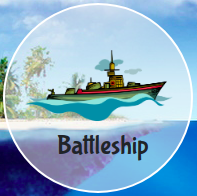
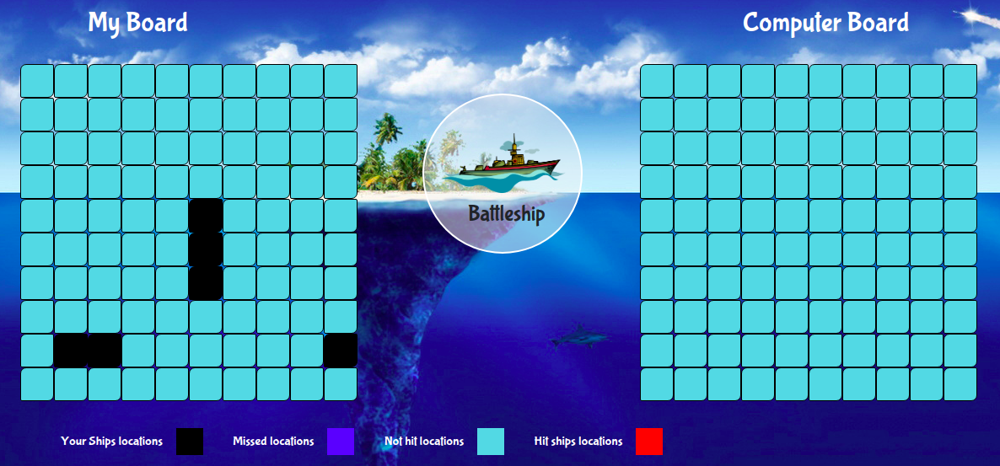

 

  

  <h3 align="center">Battleship</h3>

  

    JavaScript Project
     
     
    <a href="https://rawcdn.githack.com/samgaco/battleship/99636649edc187e84328dea52993590378bfb4dc/dist/index.html">View Demo</a>
    ·
    <a href="https://github.com/samgaco/battleship/issues">Report Bug</a>
    ·
    <a href="https://github.com/samgaco/battleship/issues">Request Feature</a>
  

<!-- TABLE OF CONTENTS -->
## Table of Contents

* [About the Project](#about-the-project)
  * [Built With](#built-with)
* [Contact](#Contact)

<!-- ABOUT THE PROJECT -->
## About The Project

  

Based on the [Battleship](https://www.theodinproject.com/courses/javascript/lessons/battleship) in the odin project as a part of the Microverse curriculum.

The purpose is to get a good understanding on Test Driven development and get some knowledge about game development.
You play againist the computer.

The following are actions that can be done on the application.
  1. Guess a the location of a ship in the Computer player grid.
  2. Based on your choice, the background of the chosen location changes accordingly.
  3. The shot can either be a hit or a miss.
  4. The player who hits all the ships first wins the game.

### Built With
* [JavaScript](https://www.javascript.com/)
* [webpack](https://webpack.js.org/)

### Contact

* [Simon Wathigo](https://github.com/wathigo) - wathigosimon@gmail.com - [Linkedin](https://www.linkedin.com/in/simon-wathigo-445370183/)
* [Samuel García Companys](https://github.com/samgaco) - samuelgarciacompanys@gmail.com - [Linkedin](https://www.linkedin.com/in/samuel-garc%C3%ADa-companys-0a848284/)
